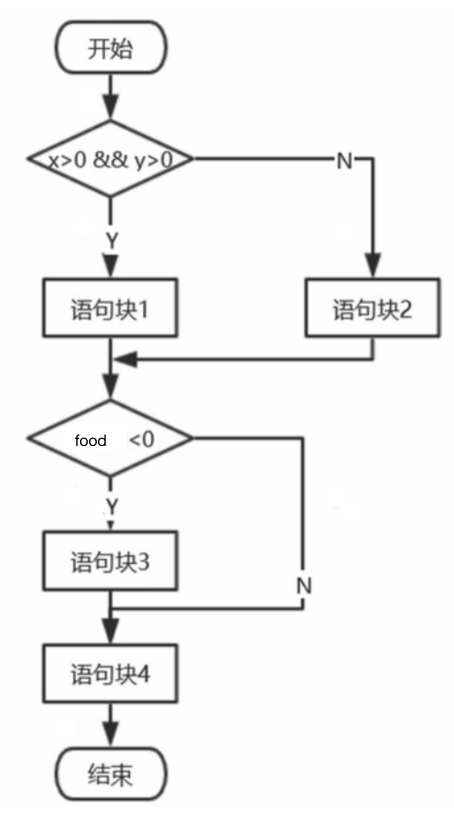

## 冷链食品信息追溯系统 测试验证脚本
<br>

##### 开场
- 教师: 同学们，今天我们来一起对冷链食品信息追溯系统进行测试验证


##### 一、环境搭建及系统部署

- 教师：前面我们已经预先配置好了实验室中的安卓一体机，搭建好了测试验证的环境，并且已经部署好了冷链食品信息追溯系统。（打开一体机实训APP中的仓储界面）
 
##### 二、单元测试
- 教师：请各位同学根据冷链追溯系统测试流程图编写程序实现对冷链追溯系统的分析处理，并设计数据进行判定覆盖测试



- *给大概1分钟左右时间写用例程序* 教师：请同学们抓紧时间 
- 教师：请各小组设计测试数据，并将设计的测试数据结合代码一起上传到冷链食品信息追溯系统测试模块的gitee仓库中去
- 教师: 下面请各小组通过gitee公共仓库查看其他小组的代码，并分析优略
  - 100%语句覆盖:(小组1的测试用例)  
    ```
    {x = 3,y = 1,magic = 2}   语句块执行为1、4
    {x = -3,y = -1,magic = -2} 语句块执行2、3、4
    ```
  - 75%语句覆盖:(小组2的测试用例)
    ```
    {x = 5,y = -3,magic = 9}  语句块执行2、4
    {x =-9,y = -6,magic = -10} 语句块执行2、3、4
    ```
  + 学生1: 老师，第二小组的测试数据中，*第一对测试数据为:x等于5，y等于-3,magic等于9，能覆盖到的语句快是2,4,第二对测试数据为x等于9，y等于-6，magic=-10*能覆盖到的语句块是2,3,4，这里并不能覆盖到语句块1，所以整体覆盖率只有75%，不能达到100%的语句覆盖。
  - 教师： 那么请问各位同学怎么修改第二组的测试数据才能达到100%的覆盖率呢？
  
  + 学生2: 我们只需要将第二组的第一对测试用例中的y等于-3修改为y等于3就能达到100%的测试覆盖率。
  
  - 教师: 学生2回答的非常好，如果将第一对测试用例中的y等于-3改为y等于3，那么在带入代码执行时就会满足x>0 && y>0这个条件，从而执行代码块1，达到100%的测试覆盖率

##### 三、设计测试文档
  - 教师: 接下来根据系统整体测试要求设计测试计划和测试报告文档，针对功能测试、性能测试、自动化测试完成测试计划、测试总结报告文档。
  - 教师：请大家按照gitee仓库中的测试用例模版设计测试用例,并将测试用例上传到gitee仓库中去
 
  1、XXXX登陆模块测试
  |测试用例编号  | 功能点 | 用例说明 | 前置条件 | 输入 | 执行步骤 | 预期结果 | 重要程度 | 执行用例测试结果  |
  | ------      | ----------- | ------                 | -----------      | ------       | ----------    | ------                     | -----------| -----------|
  | LLSP-DL-001 |登陆功能测试 | 登陆界面文字正确性验证 | 登陆页面正常显示 | 打开登陆页面 | 打开登陆页面    | 界面显示和按钮文字显示正确 | 低         | 通过       |
  | LLSP-LD-001 |登陆功能测试 | 登陆界面文字正确性验证 | 登陆页面正常显示 | 打开登陆页面 | 打开登陆页面  | 界面显示和按钮文字显示正确 | 低         | 不通过     |

  - 教师: 请各小组通过gitee公共仓库查看其他小组的测试用例设计，并分析优略
  + 学生3(第四组): 根据冷链食品信息追溯系统需求说明书，在第三组的测试用例中并没有创建仓库这个功能做测试，我们小组（第四组)在第三组的测试用例中添加了对仓库管理的测试
  - 教师：同学们在设计测试用例的时候，一定要根据需求说明书来规划设计，这样才能保证测试的完整性
  + 学生4（第一组）：老师，我们小组在观察第四组的测试用例时，发现还需要添加一个二维码扫描入库的测试，在系统需求说明书有对这项功能的要求
  - 教师: 非常好，第一组的同学们对测试用例进行了完善，一个完善的测试用例对与系统功能的测试是十分重要的，一个好的测试用例设计能够更好的测试系统的功能，从而更好的发现系统会出现的问题，为后续系统功能的开发完善以及Bug修复提供支持。

##### 四、功能测试
  - 教师: 下面我们按照冷链食品信息追溯系统测试用例完成资产管理系统的APP功能测试并编写功能缺陷Bug测试清单文档。
  - 教师：我们首先测试食品入库的功能，请第四组同学对商品入库功能进行测试
  - 教师: 为了让大家更直观的看到系统的运行过程，在实验室中，我们事先搭建了一个模拟的仓库平台，预设了了一些仓库，大家请看，在这个模拟平台中我们以英文字母为仓库名称搭建了一些仓库，每个仓库的库位上都有一个指示灯，当灯是绿色表示这个库位为空，当灯的颜色为红色表示库位有货物。
  - 教师：我们首先测试食品入库的功能，请第四组同学对商品入库功能进行测试
  + 学生5(第四组): 首先打开冷链食品信息追溯系统APP,点击按钮进入仓库管理界面，根据系统需求说明书，仓库管理界面的文字显示正确，下面测试商品入库功能，选择商品列表，点击添加商品，商品添加界面文字显示正确，按照界面的添加要求，添加2个食品:XX和XX,将XX添加到H库的X位置，将XX添加到F库的X位置，添加完成后点击确定，(点击库位刷新)我们可以看到在模拟平台中，相应仓库位置的指示灯变成了红色，我们在商品列表通过商品名称搜索刚刚添加的XX和XX,我们可以看到食品被成功的添加到库里。验证成功
  - 教师: XX同学完成了对入库的测试，那么在入库测试过程中同学能发现系统存在什么问题吗？
  - 学生6(第二组): 老师，在商品添加的时候我们小组发现，在设置食品保质期的时候只能以天为单位，但是实际生活中有些食材比如肉，牛奶，保质期是不到一天的。
  - 教师: 第二组的同学观察非常仔细，这确实是一个在程序开发时忽略的点，我们要将这个问题，编写到最后的功能缺陷Bug测试清单文档中去。
  - 教师: 下面请第三组的同学对二维码扫描入库的功能做测试
  - 学生7(第三组): 我们使用扫描枪对预先制作好的商品进行扫描，打开扫描枪的商品扫描App,选择商品上架，开始对商品进行扫描，扫描完成后点击扫描枪上的上架按钮，在显示上架成功后，我们在仓库APP中查看这几个商品的状态，显示上架表示入库成功。
  - 教师: 接下来我们请第一组的同学测试商品调度功能
  - 学生8（第一组）: 在商品调拨界面，我们将刚刚添加的食品XX，从H仓库的X号位移动到F仓库的X号位，打开H仓库，在弹出的菜单中选择要移动的位置，点击确定，请大家看移库的模拟演示，我们可以看当发出移库的指令后，运送食品的小车会从H仓库的指定位置取货，并往F仓库的指定位置。（语速慢，等小车跑完）， 转移完成后大家可以看模拟演示，H仓库的X号位置的灯已经变绿，表示这个位置的物品已经被取走了，而F仓库的X号位置的灯已经变红表示这个位置已经有物品了，我们在系统的商品列表中通过商品名称搜索XX，可以看到刚刚添加的食品库存位置已经改变了。下面我们点击调拨记录，在调拨记录中我们可以清楚的看到商品的移动轨迹，比如我们刚才移动的XX物品的调拨记录。
  - 学生9（第二组）: 老师，我们刚刚在删除商品列表中的商品时发现，如果将已存在的商品删除，比如，我们把XX食品删除，那么在调拨记录中会出现物品名称丢失的情况（咔咔一顿操作加演示）。
  - 教师: 这位同学同学观察很仔细，这里确实是一个新的Bug点。我们同学在平时生活中做任何事都要多观察，多思考。
  - 教师: 到这里我们的基本测试已经结束，下面请大家根据各组的测试情况，编写完善测试总结报告文档，并提交到gitee仓库中。
<br>
##### 五、自动化测试
- **这次肯定没时间没命弄的啦**
##### 六、性能测试
- **这次肯定没时间没命弄的啦**
##### 七、接口测试
- **这次肯定没时间没命弄的啦**
 
